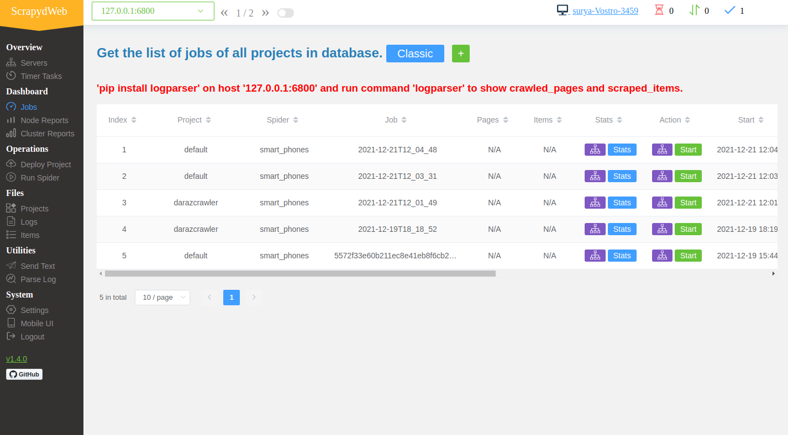
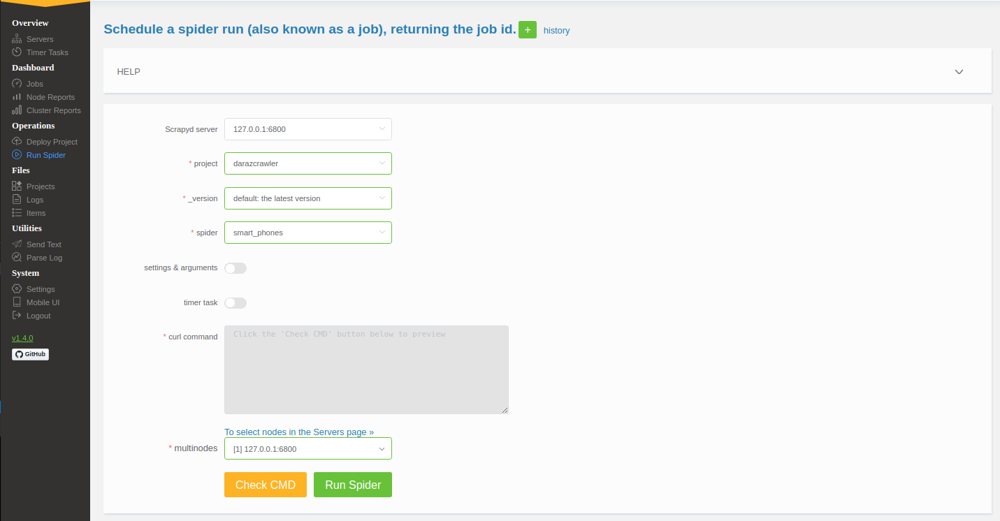

- **Python Version:** ``Python 3.8.10``

# Scrapy Deamon Web Service
An Approach to use a scrapy spiders as an independent web service with django and rabbitmq as a message broker

- **Django** as a independent application which consumes the items scraped.
- **Scrapy** python based framework for scraping smart phones listed in daraz.
- **Splash** as a javascript rendering enginee.
- **Scrapyd** to deamonize our scrapy spiders which exposes the rest endpoint for managing our spiders. 
- **Rabbitmq** as a message broker to communicate (pass scraped items independently) to our django server.

# Installation
- **Install python packages:** ``pip install -r requirements.txt``
- **Install Rabbitmq spin up** ``sudo apt-get install rabbitmq-server`` or ``docker run --name rabbitmq -p 5672:5672 rabbitmq``
- **Install Splash spin up:** ``sudo docker run -it -p 8050:8050 --rm scrapinghub/splash``

# Runing spider
- **Install python packages:** ``pip install -r requirements.txt``
- **Migrate Databse:** ``cd itemsbackend && python manage.py migrate``
- **Spin Up Dango Server:** ``cd itemsbackend && python manage.py runserver``
- **Start Django Consumer[-]** ``cd itemsbackend && python consumer.py``
- **Start scrapy deamon[-]** ``cd darazcrawler && scrapyd``
- **Web Interface[-]** ``cd darazcrawler && scrapydweb``. Default username and password `surya`
- **Deploy the default spider to deamon:** ``cd darazcrawler && scrapyd-deploy default``
- **Runing spider:** ``curl http://localhost:6800/schedule.json -d project=default -d spider=smart_phones``

> [-] => These needs to run in background / separate terminal. Or they can be daemonized to run in background
 as a separate system service.

# GUI

> JOBS

> Runing / Scheduling Spider

